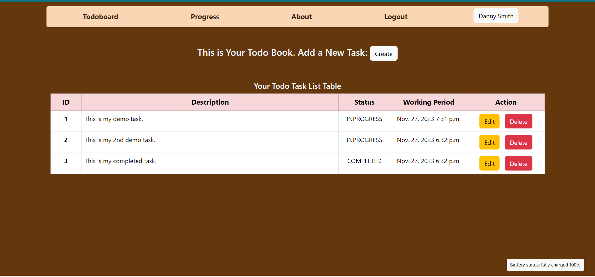

## Process

#### Project name: Todo_project
#### Project App: Todo

Contribute in the project as follows:
- git clone *project link*
- Create feature branch in your local main branch
- Make a commit
- Create a pull request with remote develop branch

### You have to follow:

Open the Terminal at the corrent project directory at *...\todo_project\* :
- Run command *python manage.py migrate*
- Run command *python manage.py runserver*
- If you want to exit from server, then press *ctrl + c*
